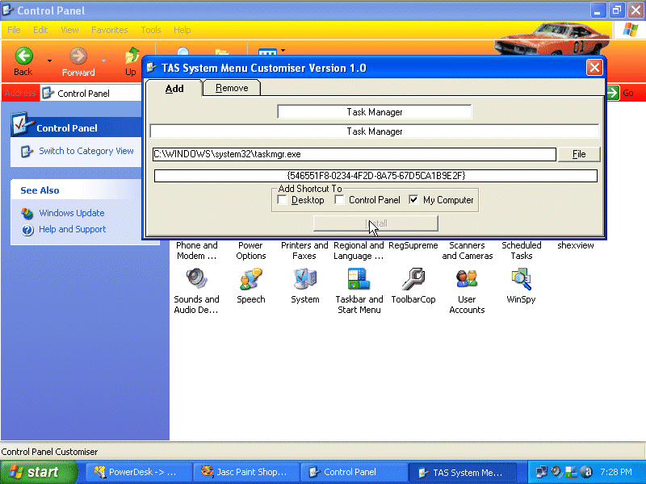



## Control Panel Customiser

### Description

Customize your desktop, control panel or my computer with any application of your choice. Includes removal archives so you can remove any application you add at any time. Uses a Uneek UUID identifier for each new tool you add so their wont be any conflicts. Another working shell tool from TAS Independent Programming !
 
### More Info
 

             |
---                |---
**Submitted On**   |2005-08-06 19:22:32
**By**             |[Thomas Swift](https://github.com/Planet-Source-Code/PSCIndex/blob/master/ByAuthor/thomas-swift.md)
**Level**          |Intermediate
**User Rating**    |4.5 (18 globes from 4 users)
**Compatibility**  |VB 6\.0
**Category**       |[Windows System Services](https://github.com/Planet-Source-Code/PSCIndex/blob/master/ByCategory/windows-system-services__1-35.md)
**World**          |[Visual Basic](https://github.com/Planet-Source-Code/PSCIndex/blob/master/ByWorld/visual-basic.md)
**Archive File**   |[Control\_Pa192195872005\.zip](https://github.com/Planet-Source-Code/thomas-swift-control-panel-customiser__1-62096/archive/master.zip)

